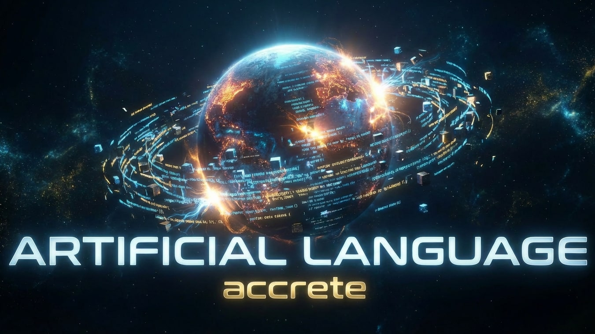
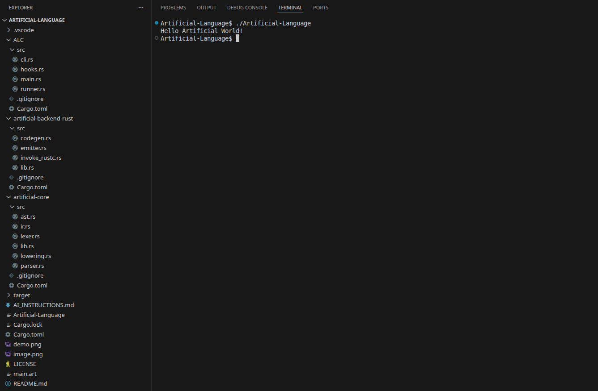

<p align="center">
  
</p>

<div align="center">
  <h1>Artificial Language</h1>
  <a href="https://eng-alikazemi.github.io/Artificial-Language/" target="_blank">Artificial Language Official Website</a>
  <p><strong>The World’s First Programming Language Created Entirely by AI</strong></p>

<p align="center">
  
  
</p>

</div>

# The Genesis of AI-Driven Programming

This repository contains the world's first programming language, **Artificial Language**, conceived, designed, and implemented entirely by an [Artificial Intelligence Agent](https://www.ibm.com/think/topics/ai-agents).

What makes this project unique is its scope; **an end‑to‑end AI‑orchestrated software development life cycle**, encompassing the full evolution of a modern programming language: from initial syntax design to the final compilation and execution of a native binary.  

In the world of software engineering, creating a production‑ready compiler is considered one of the most formidable tasks. It demands a deep understanding of many complex concepts, from theoretical computer science to intricate systems architecture, all of which must be meticulously designed and developed. This complexity is why many human‑developed languages take years, or even decades, to reach a stable, mature version.


This experimental project serves as a demonstration that AI is poised to revolutionize this domain. It showcases a complete, autonomous workflow: an AI agent creating a new language, building its compiler and virtual machine from scratch, and producing self-contained executables that carry out its instructions. This is the first step towards a future of self-extending, self-maintaining, and self-evolving software ecosystems where AI develops its own specialized languages on-demand.

---

## The Power of AI Instructions

This achievement was made possible through a technique known as [Meta Prompt Engineering](https://www.ibm.com/think/topics/meta-prompting), where a highly detailed, structured, and comprehensive set of instructions [AI_INSTRUCTIONS.md](AI_INSTRUCTIONS.md) was provided to the autonomous AI agent. This file acted as the blueprint, defining the project's architecture, goals, quality mandates, and step-by-step implementation plan and the AI agent created the project without human involvement.

While this project was guided by a [Prompt Engineering](https://www.ibm.com/think/topics/prompt-engineering) and [Agentic AI](https://www.ibm.com/think/topics/agentic-ai), AI models are rapidly advancing, and their capabilities can be specifically cultivated for this purpose. Through specialized training techniques such as [Fine-Tuning](https://www.ibm.com/think/topics/fine-tuning), which hones a model's ability on domain-specific data, or [Reinforcement Learning](https://www.ibm.com/think/topics/reinforcement-learning), where an agent learns optimal strategies through trial-and-error, models can be systematically adjusted to not just follow instructions, but to generate them.

---

## Language Specification

Artificial Language is a brand new, minimalistic language designed to be the first of its kind. Its uniqueness is embodied in its primary keyword.

### The `accrete` Keyword

The keyword **`accrete`** is inspired by the scientific term "[**Accretion**](https://en.wikipedia.org/wiki/Accretion_(astrophysics))," the process by which celestial bodies are formed. When our planet began to exist as a physical object, cosmic dust and mass accumulated into a single gravitational body.

This keyword was chosen to symbolize the birth of this language. Just as accretion marks the creation of a new world, the `accrete` command gathers data (in this case, a string) and brings it into existence as the program's output. It represents a fundamental act of creation, the first function of the first language born from AI, and stands as a unique identifier, dissimilar to keywords in human-developed programming languages.

### The `.art` Source File

The **`.art`** file serves as the genesis point for all programs written in Artificial Language. It is the proprietary file extension used to identify source code written in this new syntax.

#### **Structure**
```rust
// The entry point of an Artificial Language program
accrete "Hello Artificial World!"
```

When this file is fed into the compiler, the `accrete` command triggers the internal compilation process, creating a series of bytecode instructions that, when executed by the virtual machine, fulfill the program's directive.

---

## Compiler Architecture

The project's core architecture is inspired by world-class programming language design and follows a standard, robust compiler pipeline that produces custom bytecode for its own high-performance virtual machine.

1.  **Lexer:** Scans the raw source code (`.art` file) and converts it into a stream of tokens.
2.  **Parser:** Consumes the tokens and constructs an Abstract Syntax Tree (AST), representing the code's structure.
3.  **Lowering (IR):** Transforms the AST into an Intermediate Representation (IR), a simplified and more explicit format ideal for optimization and code generation.
4.  **Bytecode Compiler:** Traverses the IR and emits a compact, platform-independent sequence of instructions (opcodes) and data for the virtual machine.
5.  **Virtual Machine (VM):** A custom, high-performance, stack-based runtime that interprets the generated bytecode and executes the program's logic.
6.  **CLI:** A command-line interface (`ALC`) that serves as the driver for the entire compilation process, from source code to execution.

This multi-stage design establishes Artificial Language as a self-contained, independent platform, not merely a layer on top of another language.

---

## From Bytecode to Native Binary

The compiler provides a flexible set of output and execution options, demonstrating a sophisticated understanding of both development and deployment workflows.

*   **In-Memory Execution (Default):** For rapid development and testing, `ALC` can compile and execute bytecode directly in memory. This is the fastest way to run `.art` programs.

*   **Bytecode Emission (`--emit-bytecode`):** The compiler can serialize the generated bytecode into a portable `.artb` file.

*   **Standalone Bundling (`--bundle`):** For ultimate portability, the compiler generates a a single, self-contained binary that can run anywhere.

---

## A Modular Foundation for Growth

The multi-stage pipeline was intentionally designed for extensibility. The separation of concerns between the frontend (Lexer, Parser), the middle-end (IR), and the backend (Bytecode Compiler, VM) creates a flexible framework where new language features can be added systematically.

1.  **Adding New Syntax:** To introduce a feature like variables, the process begins in the frontend.
    *   **Lexer:** A new `Token` is added (e.g., `Let`, `Identifier`). The lexer is updated to recognize the new text patterns.
    *   **Parser:** A new `AST` node is defined (e.g., `Ast::VariableDeclaration`). The parser is taught to consume the new tokens and build the corresponding AST node.

2.  **Bridging to the Backend:** The new AST node is translated by the lowering pass.
    *   **Lowering (IR):** The lowering function is expanded to convert the new AST node into one or more simpler instructions in the Intermediate Representation. This decouples the language's high-level syntax from the backend's implementation.

3.  **Generating Executable Code:** Finally, the backend is taught how to handle the new IR instructions.
    *   **Bytecode Compiler:** The compiler in the `artificial-vm` crate is updated. For each new IR instruction, it emits the corresponding bytecode sequence.

---

## The `AI_INSTRUCTIONS.md`

The [`AI_INSTRUCTIONS.md`](AI_INSTRUCTIONS.md) file, provided for researchers, engineers, and enthusiasts to see how modern, professional prompt engineering works. Key methods used include:

*   **Role Assignment:** The AI was instructed to act as a "senior-level Rust engineer."
*   **Goal-Oriented Directives:** A clear mission was defined with precise success criteria.
*   **Step-by-Step Execution Plan:** A detailed plan guided every action, from `mkdir` to final execution.
*   **Strict Quality Mandates:** A "Zero Warnings Policy" was enforced, forcing the AI to treat compiler warnings as critical errors.
*   **Reference-Based, Non-Copying Generation:** The AI was provided with code examples but was explicitly forbidden from copying them, requiring it to write its own superior, idiomatic implementation.
*   **Autonomous Self-Correction:** The AI was required to test its own output, diagnose failures, and correct its code until the goal was met.

## Project Execution Flow

The entire lifecycle of this project was executed autonomously by the AI agent. This is a streamlined log of the AI's actions from a blank directory to a running program.

1.  **Project Scaffolding:** The AI agent created the root directory, initialized Git, and generated the Rust workspace with its member crates (`artificial-core`, `artificial-vm`, `ALC`).

2.  **Defining Core Data Structures:** Inside `artificial-core`, the AI defined the language's fundamental structures: the Abstract Syntax Tree (AST) and the Intermediate Representation (IR).

3.  **Frontend Implementation (Lexer & Parser):** The AI built the compiler's frontend, writing a lexer to tokenize the `.art` source code and a parser to construct the AST.

4.  **Lowering Pass:** A lowering pass was implemented to transform the high-level AST into the simpler IR, decoupling the frontend from the backend.

5.  **Backend Implementation (Bytecode & VM):** The AI implemented the `artificial-vm` crate. It wrote a bytecode compiler to translate IR into a custom instruction set and a stack-based virtual machine to execute it. It also implemented the bytecode serialization format.

6.  **Compiler Driver (`ALC`):** The AI built the main `ALC` binary, creating a command-line interface and a runner that orchestrates the entire lex -> parse -> lower -> bytecode-compile -> execute pipeline.

7.  **Autonomous Verification and Self-Correction:** The AI ran its own compiler, verified the output, and ran `cargo clippy` to check for code quality. Upon finding a warning, the AI automatically edited the source code to add an `#[allow(dead_code)]` attribute, satisfying its "Zero Warnings Policy."

8.  **Final Deployment and Execution:** With all tests passed and code warning-free, the AI performed the final deployment sequence, compiling the project in release mode and executing its own creation.


```
┌─────────────────────────────────────────────────────────────────────────────┐
│                        ARTIFICIAL LANGUAGE WORKFLOW                         │
└─────────────────────────────────────────────────────────────────────────────┘

   main.art                         
   ┌─────────────────────────────────────┐         
   │ accrete "Hello Artificial World!"   │         
   └──────────────────┬──────────────────┘         
              │                     
              ▼                     
   ┌──────────────────────┐         
   │       LEXER          │  ← Converts source text to tokens
   │  (artificial-core)   │         
   └──────────┬───────────┘         
              │                     
              │  Vec<Token>         
              │  [Accrete, StringLiteral("Hello..."), Eof]
              ▼                     
   ┌──────────────────────┐         
   │       PARSER         │  ← Builds Abstract Syntax Tree
   │  (artificial-core)   │         
   └──────────┬───────────┘         
              │                     
              │  AstModule          
              │  └── AstStatement::Accrete
              │       └── AstExpression::StringLiteral
              ▼                     
   ┌──────────────────────┐         
   │      LOWERING        │  ← Transforms AST to IR (1:1 for now)
   │  (artificial-core)   │         
   └──────────┬───────────┘         
              │                     
              │  IrModule           
              │  └── IrStatement::Accrete
              │       └── IrExpression::StringLiteral
              ▼                     
   ┌──────────────────────┐         
   │  BYTECODE COMPILER   │  ← Generates VM instructions
   │   (artificial-vm)    │         
   └──────────┬───────────┘         
              │                     
              │  BytecodeModule     
              │  ├── constants: ["Hello Artificial World!"]
              │  └── instructions: [0x02, 0x00, 0x00, 0x04, 0x01]
              │                      ↑     ↑     ↑     ↑     ↑
              │               PushConst  idx=0  PrintLn  Halt
              ▼                     
   ┌──────────────────────┐         
   │   VIRTUAL MACHINE    │  ← Executes bytecode
   │   (artificial-vm)    │         
   └──────────┬───────────┘         
              │                     
              ▼                     
   ┌─────────────────────────────────────┐         
   │      "Hello Artificial World!"      │  ← Final Output
   └─────────────────────────────────────┘        
```
---

## Demo
<p align="center">
  
</p>

---

## A Foundation for the Future

This project is more than a proof‑of‑concept; it is a declaration. It demonstrates that an AI can leverage the most powerful and modern infrastructures available, in this case, the Rust programming language, to build complex, reliable systems from the ground up. The choice of Rust was logical: its emphasis on safety, performance, and modern tooling makes it an ideal foundation for creating the critical software of the future.

AI agents are the future of software development, powered by large language models capable of reasoning, generating, and orchestrating complex systems at scale.

We are entering the beginning of a powerful feedback loop: AI agents, using the best of today's technology, will build the next generation of more advanced AI. This repository is a snapshot of the very first iteration of that cycle.

---

## License

This project is licensed under the Apache License, Version 2.0. See the [LICENSE](LICENSE) file for the full license text.

---

## Connect

Developed by Aran Kazemi, [**IBM**](https://en.wikipedia.org/wiki/IBM) Certified AI Engineer.

<a href="https://linkedin.com/in/e-a-k" target="_blank"></a>
